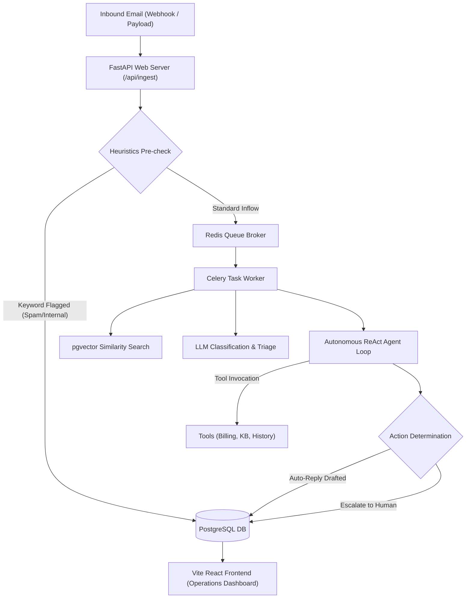

# CRM Intelligence Platform (Agentic Ops Platform)

An enterprise-ready, AI-powered CRM operations inbox and autonomous agent routing system. It ingests incoming customer emails, clusters them into conversational threads, runs real-time heuristics checks, performs structured LLM triage, executes a multi-step autonomous ReAct agent loop with registered tools, and displays it on a premium interactive dark-mode React dashboard.

---

## 1. Problem Statement

Modern enterprise customer support teams face high volumes of incoming customer correspondence. This results in:
- **Delayed Response Times**: Critical P0 outages, SLA breaches, and legal threats go unnoticed in spam or low-priority folders.
- **Fragile Automation**: Traditional rules-based systems are static, case-sensitive, and cannot analyze customer sentiment or extract complex entities.
- **Lack of Unified Context**: Support agents must manually toggle between billing databases, knowledge repositories, and external rating websites (like G2 or Trustpilot) to understand who a customer is and what their churn threat level represents.
- **Compliance Vulnerabilities**: High-risk items (such as GDPR Article 20 Right to Portability requests or ransomware extortion) are accidentally replied to automatically, posing legal and security hazards.

### The Solution: CRM Intelligence Platform
This platform solves these inefficiencies by combining:
1. An **Asynchronous Ingestion Pipeline** running under 10ms.
2. An **Autonomous ReAct Agent Loop** running custom tools to retrieve company policies, check billing profiles, and draft context-specific replies.
3. A **RAG (Retrieval-Augmented Generation) Vector Store** (`pgvector`) queryable under 200ms.
4. A **Triple-Pane Operations Portal** that visualizes threads, contact data, web sentiment intelligence, collapsible agent reasoning chains, and manual override controls.

---

## 2. System Architecture

The following diagram illustrates how inbound emails flow through the system:



---

## 3. Project Structure

```
SenAI Project Assignment/
├── backend/
│   ├── app/
│   │   ├── api/
│   │   │   └── endpoints.py          # API route definitions
│   │   ├── db/
│   │   │   ├── init_db.py            # Enables pgvector, creates schemas
│   │   │   ├── models.py             # 7 SQLAlchemy models + performance indexes
│   │   │   └── session.py            # Database connections (async/sync)
│   │   ├── schemas/
│   │   │   ├── agent.py              # Pydantic schemas for agent actions/drafts
│   │   │   ├── contact.py            # Pydantic schemas for CRM profiles
│   │   │   ├── email.py              # Pydantic schemas for email ingestion
│   │   │   └── thread.py             # Pydantic schemas for thread timeline feeds
│   │   ├── services/
│   │   │   ├── agent_workflow.py     # 6-step ReAct state machine loop & tools
│   │   │   ├── heuristics.py         # Sub-10ms synchronous keywords triage
│   │   │   ├── llm.py                # Structured LLM triage & sentiment extractor
│   │   │   ├── rag.py                # Document loader, chunk splitter, pgvector query
│   │   │   └── scraper.py            # Reputation web scraper & robots.txt compliance
│   │   ├── workers/
│   │   │   └── tasks.py              # Celery background tasks & connection pools
│   │   └── main.py                   # FastAPI initialization & error envelopes
│   ├── requirements.txt              # Backend dependencies
│   ├── seed_kb.py                    # Seeding script for RAG markdown files
│   └── test_ingest_internal.py       # Ingest diagnostics check
├── frontend/
│   ├── src/
│   │   ├── components/
│   │   │   ├── AnalyticsDashboard.tsx # View 3: Recharts reports & heatmaps
│   │   │   ├── InboxList.tsx          # View 1: Mission Control Inbox filters
│   │   │   └── ThreadWorkspace.tsx    # View 2: Multi-pane chron Timeline & Trace
│   │   ├── App.tsx                    # Main viewport layout coordinator
│   │   ├── index.css                  # CSS glassmorphism and animations
│   │   └── main.tsx                   # React root launcher
│   ├── package.json                   # Frontend node dependencies
│   ├── tailwind.config.js             # Layout configuration
│   └── vite.config.ts                 # Dev server rules
├── knowledge_base/                    # Markdown knowledge documents
│   ├── pricing_policy.md
│   ├── sla_policy.md
│   ├── refund_policy.md
│   ├── api_docs.md
│   ├── compliance_faq.md
│   └── escalation_matrix.md
├── docker-compose.yml                 # Multi-container coordinator
├── .gitignore                         # Local caches and logs exclusion
├── memory.md                          # Persistent iteration log
└── walkthrough.md                     # Code base walkthrough
```

---

## 4. Module & File Breakdown

### Backend Services (`backend/app/services/`)
- **`heuristics.py`**: A synchronous helper executing under 10ms. Evaluates incoming email text for blacklisted spam keywords, matches internal employee addresses, and detects threat vectors.
- **`ingestion.py`**: Coordinates transactional integrity. Determines if an email belongs to an existing thread, generates contact profiles dynamically if they do not exist, and queues a Celery background job.
- **`rag.py`**: Handles RAG operations. Reads markdown documents in `knowledge_base/`, chunks text into 350-word passages with a 50-word overlap, computes OpenAI/mock vector embeddings, and performs cosine similarity queries.
- **`llm.py`**: Connects to the OpenAI API (with a rules-based fallback engine) using Pydantic structured output models. Triages the category, urgency, sentiment score, requires_human escalation, and extracts key entities (names, order IDs, wallet hashes).
- **`agent_workflow.py`**: Executes an autonomous ReAct loop of up to 6 steps. Registers tools like `tool_search_knowledge_base`, `tool_get_thread_history`, `tool_get_contact_profile`, and `tool_check_account_status`. It outputs a detailed trace of reasoning blocks (Thought $\rightarrow$ Action $\rightarrow$ Observation).
- **`scraper.py`**: Implements a public sentiment scraper for Trustpilot, G2, and Capterra. Employs user-agent rotations and robots.txt parsing, storing values under a 6-hour cache.

### Backend Routing (`backend/app/api/`)
- **`endpoints.py`**: Houses REST endpoints coordinating stats, thread fetching, custom responses, draft patching/approvals, dry-runs, and database wipes.

### Backend Workers (`backend/app/workers/`)
- **`tasks.py`**: Configures Celery background tasks. Disposes of the database engine via `await engine.dispose()` inside a `finally` block to prevent asyncio event loop mismatches across task executions.

### Database Layer (`backend/app/db/`)
- **`models.py`**: Defines database tables (Email, Thread, Contact, Action, AuditLog, WebIntelligenceCache, KnowledgeChunk) with pgvector integration and datetime indexing.

---

## 5. API Endpoints Reference

The backend exposes the following REST routes (all errors return a consistent schema format):

| Method | Route | Description |
| :--- | :--- | :--- |
| `POST` | `/api/ingest` | Ingests email webhook payloads; schedules Celery background jobs. |
| `GET` | `/api/status/{job_id}` | Polls Celery background job processing progress. |
| `GET` | `/dashboard/stats` | Retrieves counts for pending, replied, escalated, critical, and spam. |
| `GET` | `/threads` | Returns list of all active threads for the inbox pane. |
| `GET` | `/threads/{email}` | Fetches timeline emails and action drafts for a specific sender. |
| `POST` | `/respond/{email_id}` | Dispatches a manual human response email and marks thread Resolved. |
| `PATCH` | `/drafts/{action_id}` | Modifies the proposed auto-reply content draft. |
| `POST` | `/drafts/{action_id}/approve` | Approves and dispatches a proposed auto-reply email. |
| `GET` | `/analytics/sentiment-trend` | Fetches historical average daily sentiment metrics. |
| `GET` | `/analytics/category-breakdown` | Aggregates email counts grouped by system categories. |
| `GET` | `/rag/search` | Queries the pgvector document database using cosine similarity. |
| `GET` | `/intelligence/reputation` | Fetches scraped ratings and complaint lists for a company domain. |
| `POST` | `/agent/dry-run/{email_id}` | Runs ReAct workflow simulation without database commits. |
| `GET` | `/audit/{type}/{id}` | Returns historic audit trail records (updates, status shifts). |
| `GET` | `/contacts` | Returns list of all contact profiles. |
| `PATCH` | `/contacts/{email}/status` | Updates statuses (VIP, Blocked, Active) to alter pipeline behavior. |
| `POST` | `/api/reset` | Flushes transactional data and rebuilds knowledge base vector spaces. |

---

## 6. How to Run the Environment

### Complete Startup Command
Execute the following in the root directory to compile, build, and deploy all services:
```bash
docker-compose up --build
```

### Port Mappings
- **Vite React Frontend Portal**: [http://localhost:5173](http://localhost:5173)
- **FastAPI Documentation (Swagger UI)**: [http://localhost:8000/docs](http://localhost:8000/docs)

---

## 7. Sandbox Verification & Key Scenarios

Use the **Simulation Console** (right side panel) in the web portal to run tests:
1. **Bob Jones P0 Outage Escalation (msg_060)**:
   - Triggers the ReAct loop: `get_thread_history` $\rightarrow$ `search_knowledge_base` $\rightarrow$ `check_account_status` $\rightarrow$ `flag_for_legal` $\rightarrow$ `draft_reply` $\rightarrow$ `escalate_to_human`.
   - Thread status changes to `Escalated`, and "October 1st" deadline is highlighted in purple.
2. **Karen W Churn & Reputation Crisis (msg_033)**:
   - Scrapes star ratings for `retail-co.com` (showing slow support themes) and retrieves retention offers from the RAG refund playbook.
3. **GDPR Article 20 Request (msg_052)**:
   - Categorized as compliance; locks auto-replies and sets a legal review flag.
4. **Ransomware & Extortion Attack (msg_038)**:
   - Heuristics blocklist detects threat keywords instantly, labels urgency as `Critical`, blocks auto-replies, and creates safety escalations.

---

## 8. Environment Variables

The platform runs out-of-the-box using standard settings defined in `docker-compose.yml`. For custom environments, the following variables can be configured:

- `DATABASE_URL`: Connection string for SQLAlchemy async operations (e.g., `postgresql+asyncpg://postgres:postgres@db:5432/crmdb`).
- `DATABASE_SYNC_URL`: Connection string for Alembic and SQLAlchemy sync operations (e.g., `postgresql://postgres:postgres@db:5432/crmdb`).
- `REDIS_URL`: URL for Celery task broker and backend store (e.g., `redis://redis:6379/0`).
- `OPENAI_API_KEY`: API Key for structured output classification, agent ReAct thinking, and RAG embeddings. (If left empty, the system automatically falls back to deterministic rules-based evaluations for mock testing).

---

## 9. Technology Stack Selection & Architectural Decisions

### Technology Stack Justifications

To achieve enterprise-grade reliability and visual excellence, the platform's core technologies were selected based on the following architectural justifications:

1. **FastAPI (Backend Application Framework)**:
   - *Async-First Design*: Native support for `async/await` allows the API server to handle hundreds of concurrent WebSocket and REST requests under heavy load.
   - *Pydantic Type Validation*: Guarantees data sanitization and strict API input/output serialization. It also maps directly to the structured JSON schemas generated by the LLM classification engine.
   - *Autogenerated Docs*: Instant Swagger UI (/docs) simplifies integration testing and API evaluation.
2. **React + Vite + Tailwind CSS (Frontend Viewport)**:
   - *React Component Hierarchy*: Perfect for coordinate-heavy, interactive interfaces like the triple-pane workspace.
   - *Vite Builder*: Provides sub-second hot reloading (HMR) and optimized build bundles, making the frontend interface extremely snappy.
   - *Tailwind CSS & Glassmorphism*: Allowed the implementation of high-performance custom dark-mode aesthetics, subtle borders, and glow effects without the overhead of heavy component libraries.
3. **PostgreSQL with pgvector (Relational + Vector DB)**:
   - *Unified Schema Architecture*: Storing relational customer profiles, emails, and multi-step actions alongside vector chunks in the same ACID-compliant database eliminates the synchronization lag, extra networking, and operational overhead of separate vector DBs (e.g. Pinecone).
   - *Native Cosine Similarity*: Allows efficient vector searches (`<=>` operator) in SQL queries with custom indexes (`ivfflat` / `hnsw`), keeping RAG fetches under 200ms.
4. **Celery + Redis (Asynchronous Worker & Broker)**:
   - *Decoupled Processing*: The ReAct agent execution (doing multiple RAG lookups, LLM queries, and web scrapes) can take several seconds. Offloading this workload to Celery background tasks ensures the webhook ingestion API remains lightning fast (<10ms).
   - *High-Speed Pub/Sub Bus*: Redis serves as Celery's message broker and as the real-time event stream channel for active WebSockets.
5. **FastAPI WebSockets + Redis Pub/Sub (Real-time Event Streaming)**:
   - *Event-Driven Updates*: Pushing event payloads dynamically avoids the network overhead and delay of client polling, resulting in instant dashboard UI updates.

### Architectural Decisions & Trade-offs

- **Task Queuing (Celery + Redis)**: Ingesting an email needs to trigger a multi-step agent loop (LLM analysis, RAG searches, web scraping, and profile queries). Running this synchronously would block the user webhook request and degrade HTTP performance. Using Celery ensures the webhook receives a fast 201 response while processing runs in the background.
- **Async & Sync Database Splits**: Python's asyncio is used for FastAPI's endpoints to handle high-concurrency requests, while Celery worker threads run tasks inside synchronous execution contexts. The database setup includes both async engines (`DATABASE_URL`) and sync engines (`DATABASE_SYNC_URL`) to support both models cleanly.
- **Fast Heuristic Pre-checks**: Before initiating expensive vector searches or LLM calls, a local regex keyword filter runs under 10ms. This prevents spam or internal team messages from using token quotas.
- **Cache-First Scraper**: Web ratings for sender domains are fetched dynamically from review sites (G2/Capterra/Trustpilot) but are cached in the PostgreSQL database for 6 hours. This complies with crawl etiquette, avoids getting rate-limited, and guarantees sub-50ms responses for dashboard workspace updates.

---

## 10. Known Limitations

- **Mock LLM Coverage**: In sandbox mode (without a valid `OPENAI_API_KEY`), the LLM pipeline uses rules-based mock triages. These mocks are optimized for the provided preset test cases (Bob Jones, Karen W, GDPR, Ransomware) and may not generalize to arbitrary text payloads.
- **Scraper Proxy Limitations**: The sentiment scraper relies on standard `urllib` queries with mock user-agents. In production, scraping protected domains (like G2) would require integration with a proxy rotating API (like ScrapingBee) to bypass Cloudflare antibot protection.
- **Alembic in Docker Volume**: Running Alembic migrations generates local Python files inside the Docker container. Volume mounts map `/app/alembic` to the host directory, ensuring local version control synchronization, but requires standard write permissions on the host system.
