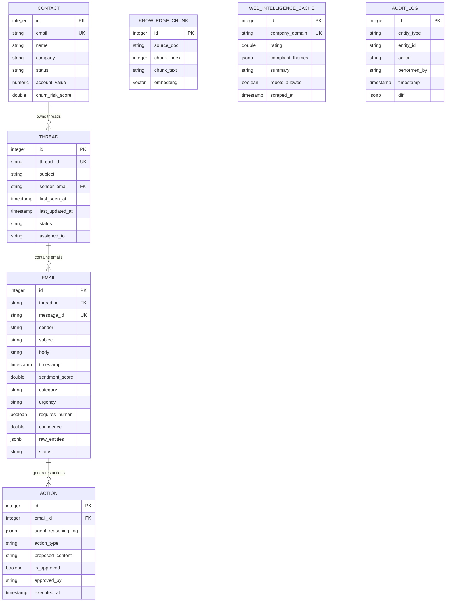

# Database Schema & ER Diagram

This document contains the Entity-Relationship (ER) Diagram and the exact DDL schema definitions for the PostgreSQL database tables used by the CRM Intelligence Platform.

---

## 1. Entity-Relationship (ER) Diagram

The relationships between CRM contacts, threads, emails, agent actions, intelligence cache, audit logs, and knowledge store chunks are illustrated below:



---

## 2. SQL Schema DDL (PostgreSQL)

Below is the raw SQL code representing the tables, foreign keys, indexes, and pgvector types:

```sql
-- Enable the vector extension
CREATE EXTENSION IF NOT EXISTS vector;

-- 1. CONTACTS TABLE
CREATE TABLE contacts (
    id SERIAL PRIMARY KEY,
    email VARCHAR(255) UNIQUE NOT NULL,
    name VARCHAR(255),
    company VARCHAR(255),
    status VARCHAR(50) DEFAULT 'Active',
    account_value NUMERIC(12, 2) DEFAULT 0.0,
    churn_risk_score DOUBLE PRECISION DEFAULT 0.0
);
CREATE INDEX ix_contacts_email ON contacts (email);

-- 2. THREADS TABLE
CREATE TABLE threads (
    id SERIAL PRIMARY KEY,
    thread_id VARCHAR(255) UNIQUE NOT NULL,
    subject VARCHAR(255),
    sender_email VARCHAR(255) REFERENCES contacts(email) ON DELETE SET NULL,
    first_seen_at TIMESTAMP WITHOUT TIME ZONE,
    last_updated_at TIMESTAMP WITHOUT TIME ZONE,
    status VARCHAR(50) DEFAULT 'Open',
    assigned_to VARCHAR(255)
);
CREATE INDEX ix_threads_thread_id ON threads (thread_id);
CREATE INDEX ix_threads_first_seen_at ON threads (first_seen_at);
CREATE INDEX ix_threads_last_updated_at ON threads (last_updated_at);

-- 3. EMAILS TABLE
CREATE TABLE emails (
    id SERIAL PRIMARY KEY,
    thread_id VARCHAR(255) REFERENCES threads(thread_id) ON DELETE CASCADE,
    message_id VARCHAR(255) UNIQUE NOT NULL,
    sender VARCHAR(255) NOT NULL,
    subject VARCHAR(255),
    body TEXT,
    timestamp TIMESTAMP WITHOUT TIME ZONE NOT NULL,
    sentiment_score DOUBLE PRECISION DEFAULT 0.0,
    category VARCHAR(50),
    urgency VARCHAR(50) DEFAULT 'Medium',
    requires_human BOOLEAN DEFAULT FALSE,
    confidence DOUBLE PRECISION DEFAULT 1.0,
    raw_entities JSONB DEFAULT '{}'::jsonb,
    status VARCHAR(50) DEFAULT 'Received'
);
CREATE INDEX ix_emails_message_id ON emails (message_id);
CREATE INDEX ix_emails_timestamp ON emails (timestamp);

-- 4. ACTIONS (AGENT TRACES & AUTO REPLIES)
CREATE TABLE actions (
    id SERIAL PRIMARY KEY,
    email_id INTEGER REFERENCES emails(id) ON DELETE CASCADE,
    agent_reasoning_log JSONB DEFAULT '[]'::jsonb,
    action_type VARCHAR(50) NOT NULL,
    proposed_content TEXT,
    is_approved BOOLEAN DEFAULT FALSE,
    approved_by VARCHAR(255),
    executed_at TIMESTAMP WITHOUT TIME ZONE
);

-- 5. KNOWLEDGE CHUNKS TABLE (RAG VECTOR STORE)
CREATE TABLE knowledge_chunks (
    id SERIAL PRIMARY KEY,
    source_doc VARCHAR(255) NOT NULL,
    chunk_index INTEGER NOT NULL,
    chunk_text TEXT NOT NULL,
    embedding VECTOR(1536) -- 1536-dimensional vector for OpenAI text-embedding-3-small / text-embedding-ada-002
);

-- 6. WEB INTELLIGENCE CACHE TABLE
CREATE TABLE web_intelligence_cache (
    id SERIAL PRIMARY KEY,
    company_domain VARCHAR(255) UNIQUE NOT NULL,
    rating DOUBLE PRECISION,
    complaint_themes JSONB DEFAULT '[]'::jsonb,
    summary TEXT,
    robots_allowed BOOLEAN DEFAULT TRUE,
    scraped_at TIMESTAMP WITHOUT TIME ZONE NOT NULL
);
CREATE INDEX ix_web_intelligence_cache_company_domain ON web_intelligence_cache (company_domain);

-- 7. AUDIT LOGS TABLE
CREATE TABLE audit_logs (
    id SERIAL PRIMARY KEY,
    entity_type VARCHAR(50) NOT NULL,
    entity_id VARCHAR(255) NOT NULL,
    action VARCHAR(100) NOT NULL,
    performed_by VARCHAR(100) NOT NULL,
    timestamp TIMESTAMP WITHOUT TIME ZONE NOT NULL,
    diff JSONB DEFAULT '{}'::jsonb
);
CREATE INDEX ix_audit_logs_timestamp ON audit_logs (timestamp);
```
